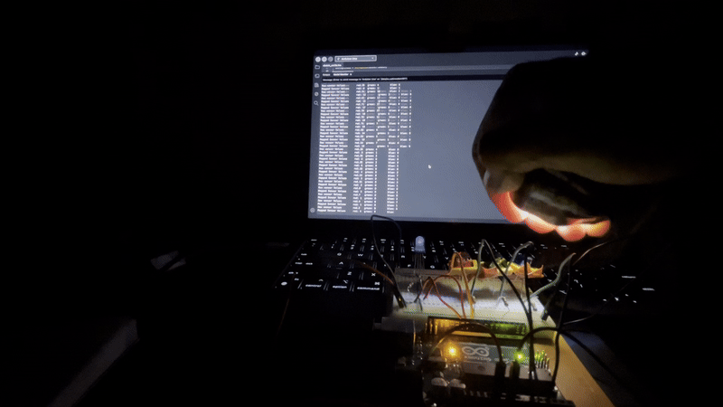

# ArduinoProjects

In an attempt to better understand embedded systems and embedded C, I am building small projects that track data, interact with hardware, and eventually log results. Each project is meant to build on my knowledge of C/C++, Arduino, and embedded systems concepts. This is a self-driven endeavour to reach my goal of become an embedded systems engineer. The purpose of this repo is to share my projects, ideas, and technical knowledge.

** Project README's have wiring, hardware needed, and schematics. **

## 🎥 Project Highlights

| SensorTemp | Mood Lighting |
|------------|---------------|
|  |  |

---

## 📂 Projects

1. sensorTemp

Link to project: https://github.com/Fresht0Death/ArduinoProjects/edit/main/README.md#:~:text=sensorTemp

Description:
Reads temperature from a TMP36 sensor, tracks the hottest and coldest values of the day (°F), and displays temperature ranges with 3 LEDs (°C bands).
Features:
Converts analog readings → voltage → °C and °F
Tracks min/max in °F
LED indicators show temperature zones based on °C thresholds
Prints live readings + min/max to Serial Monitor

2. potentiometerLEDs

Link to project: 
https://github.com/Fresht0Death/ArduinoProjects/edit/main/README.md#:~:text=potentiometerLEDs

Description:
A potentiometer controls a 3-LED bar display plus a blue LED. The bar LEDs act as thresholds, while the blue LED pulses using PWM when the potentiometer is above a high threshold.
Features:
Maps analog input (0–1023) → percentage (0–100%)
Lights up LEDs step-by-step as the potentiometer increases
Uses PWM to create a fading pulse effect on the blue LED when the top band is reached
Practice with state machines, PWM, and analog scaling

3. spaceshipInterface

Link to project: https://github.com/Fresht0Death/ArduinoProjects/edit/main/README.md#:~:text=Space_Ship_Interface

Description:
A simple interactive project inspired by the “spaceship interface” Arduino example. Uses LEDs to simulate a control panel, with input from a pushbutton to trigger LED sequences.
Features:
Digital input via pushbutton
LED sequencing logic (left/right blink)
Timing control using delay() and experiments with millis()
First intro into simple state machine logic

4. MoodLighting

Link to project: 
https://github.com/Fresht0Death/ArduinoProjects/edit/main/README.md#:~:text=MoodLighting

Desription:
A project where different light spectrum levels are used as input via a phototransitor. Depending on what phototransistor recieves the most light, this information is translated to the Cathod RGB LED to represent what light spectrum is being input the most. 
Features:
*Cool mood lighting*
Light spectrum input and output
Digital to analog input calculation
PWM pins being used to handle Cathod RGB light

